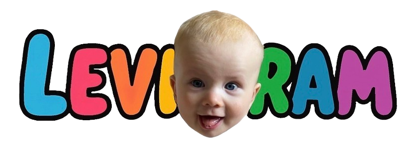

# Hi, I'm Viktor 👋

I'm an aspiring **Software Developer** with a focus on modern frontend technologies.  
After nearly 10 years of self-employment in data management, I transitioned into web development by completing a certified **Full Stack Web Developer** program.  
During an internship at **IBM CIC**, I deepened my skills in **React, TypeScript, Lit Web Components**, and **Accessibility**, while working in agile teams.

---

## 🚀 Featured Project: Levigram

  

Levigram is a private social media web app I built especially for my son, so that our family and friends can share personal content in a safe and private environment.  
It’s designed to be simple, mobile-friendly, and optimized as a **Progressive Web App (PWA)**.  
Users can **create posts**, **like**, **comment**, and receive **real-time push notifications**.

👉 [See full README with screenshots](https://github.com/ViktorPisarczyk/Levigram_FE#readme)

🔗 **Repositories**

- [Frontend (React + Vite)](https://github.com/ViktorPisarczyk/Levigram_FE)
- [Backend (Node.js + Express + MongoDB)](https://github.com/ViktorPisarczyk/Levigram_BE)

---

## 🛠️ Tech Stack

---

## 📫 Get in Touch

- ✉️ [Email me](mailto:viktor.pisarczyk@gmail.com)
- 💼 [LinkedIn](https://www.linkedin.com/in/viktor-pisarczyk)
